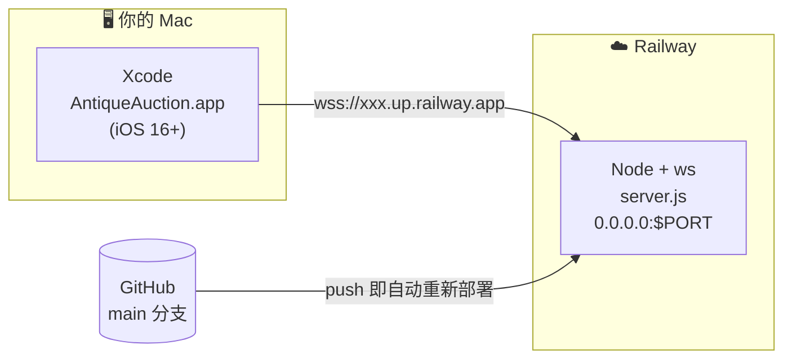
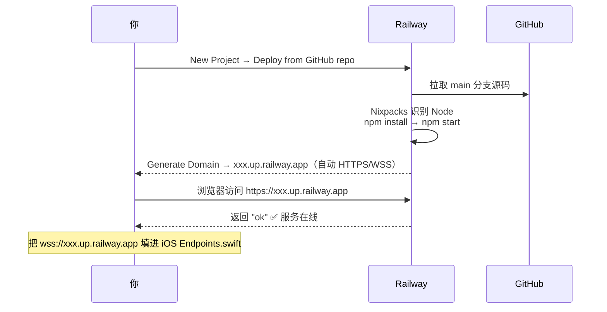
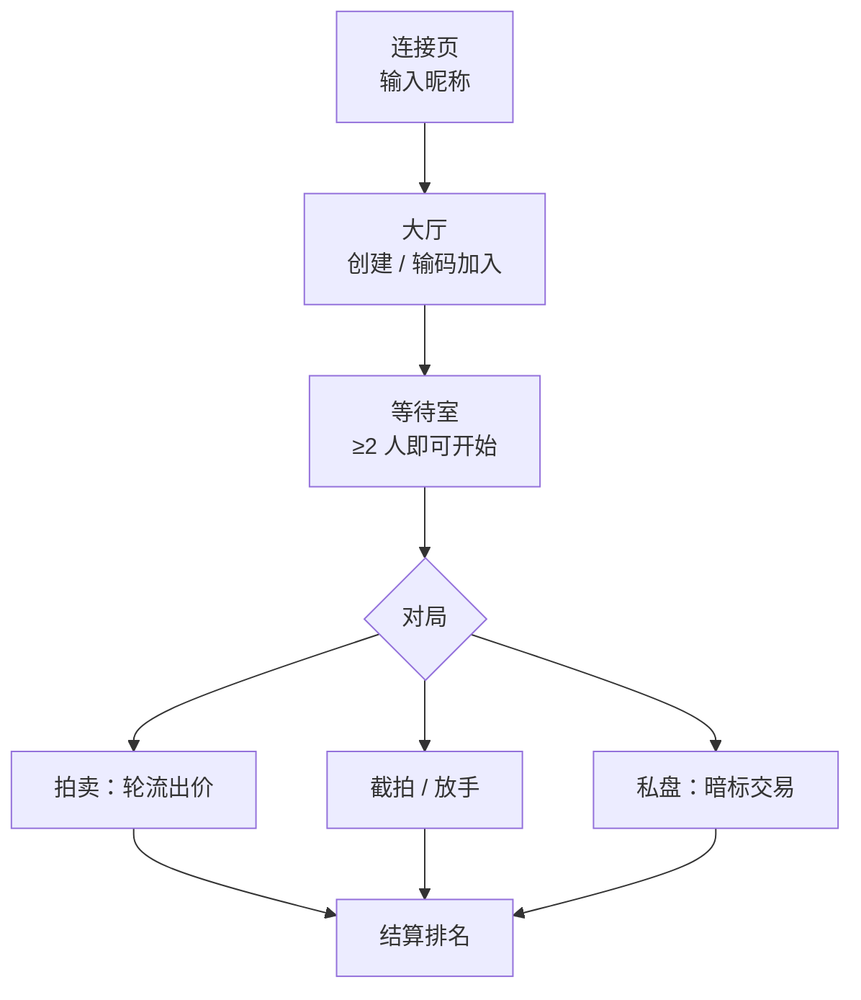
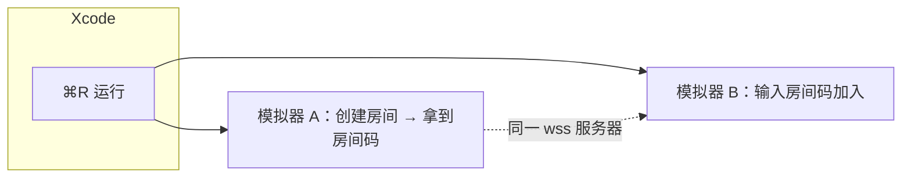

# 从零跑通与上线 · 图文指引（Xcode + Railway）

本指引带你把这套「古董拍卖」**后端部署到 Railway**、并在 **Xcode 里把 iOS 客户端跑起来**，最后两端联调成一个能和朋友对战的在线游戏。

> 图为示意（Mermaid / 文字框），不是真实截图，但每一步都对应 Railway / Xcode 里的真实操作位置。
> iOS 工程的完整建立步骤见 [`ios/README.md`](../ios/README.md)；本文是「端到端」串讲，iOS 部分做精简 + 关键补充。

## 全景



**推荐顺序：先部署后端（拿到 `wss://` 地址）→ 再回 Xcode 把地址填进 `Endpoints.swift` → 运行。** 因为 iOS 端必须知道服务器地址才能连。

## 0 · 准备清单

| 你需要 | 说明 |
|---|---|
| 一台 Mac + **Xcode 15+** | 自带 iOS 16 SDK；App Store 免费安装 |
| **Railway 账号** | [railway.app](https://railway.app)，用 GitHub 登录最省事 |
| **GitHub 上的本仓库** | `teribinlau/antique-auction-server`，`main` 分支已含 `server.js` / `package.json` |
| （可选）Node 18+ | 仅「本地不部署也想先试」时需要；纯上线不必装 |
| （可选）Apple 开发者账号 | 仅在想用 **真机 / TestFlight** 分发时需要（$99/年）；模拟器联调不需要 |

---

# 第一部分 · 后端部署到 Railway

本服务是**有状态、内存、单实例**的 WebSocket 服务（房间和牌局都在内存里）。开箱即可部署——`server.js` 已经：

- 读取 `process.env.PORT`（Railway 会自动注入），并绑定 `0.0.0.0`；
- 在 HTTP `GET /` 返回 `ok`，可直接当**健康检查**；
- 用 `ws` 在同一个 HTTP 服务器上处理 WebSocket 升级（同域名、同端口，无需额外配置）。



### 步骤

**1. 新建项目并连仓库**

登录 Railway → 右上 **New Project** → **Deploy from GitHub repo** → 授权并选择 `teribinlau/antique-auction-server` → 选 **`main`** 分支。

```
Railway Dashboard
└─ New Project
   └─ ▸ Deploy from GitHub repo
        └─ teribinlau/antique-auction-server   [Deploy]
```

**2. 让它自己构建**

Railway 用 Nixpacks 自动识别这是 Node 项目，依次执行 `npm install` 和 `npm start`（即 `package.json` 里的 `node server.js`）。**无需** Procfile、Dockerfile 或自定义构建命令。仓库已通过 `engines.node` 固定到 Node 20，构建更稳定。

**3. PORT 无需配置**

Railway 会注入环境变量 `PORT`，`server.js` 已用 `process.env.PORT || 3000` 读取——**不要**自己写死端口。无其它必填环境变量。

**4. 生成公网域名**

进入该服务 → **Settings → Networking → Generate Domain**（或 Public Networking）。得到形如 `xxx.up.railway.app` 的域名，Railway 自动为它配好 TLS（HTTPS / WSS）。

```
Service ▸ Settings ▸ Networking
   Public Networking:  [ Generate Domain ]
   → xxxxxxxx.up.railway.app     🔒 HTTPS / WSS
```

**5. 验证服务在线**

浏览器打开 `https://xxx.up.railway.app`，应显示纯文本 **`ok`**。看到 `ok` 就说明进程已起、端口正确。

**6. 得到 WebSocket 地址**

把 `https` 换成 `wss`（同域名、不带端口）：

```
浏览器健康检查   https://xxx.up.railway.app   → ok
iOS 要填的地址   wss://xxx.up.railway.app
```

**7.（推荐）健康检查 + 单副本 + 不休眠**

因为状态全在内存，务必：

| 设置 | 位置 | 值 | 原因 |
|---|---|---|---|
| Replicas（副本数） | Settings → Deploy | **1** | 多副本会各自持有不同房间，连到哪台全凭运气 |
| Healthcheck Path | Settings → Deploy | `/` | 返回 `ok`，新部署只在健康后才切流量 |
| 不休眠 / 不缩到 0 | Settings | 关闭 sleep / scale-to-zero | **休眠＝进程被杀＝进行中的房间全部丢失** |

**8. 之后的自动部署**

每次向 GitHub 的 `main` push，Railway 都会自动重新构建部署（CD）。排错看 **Deployments → 选中一次部署 → View Logs**，正常会打印：

```
服务器运行在 ws://0.0.0.0:8080      ← 这里的端口是 Railway 注入的 $PORT，正常现象
```

> 计费：Railway 按用量计费并提供一定免费额度，超出需绑卡；具体以 [railway.app](https://railway.app) 当前方案为准。其它支持「常驻、单实例、WebSocket」的平台（Render、Fly.io 等）同理——关键是别让它休眠或多副本。

---

# 第二部分 · 在 Xcode 跑通 iOS 客户端

本仓库 `ios/` 目录只含 **Swift 源码**，不含 `.xcodeproj`（手写工程文件极易出错）。所以第一次需要新建工程并把源码拖进去。下面是精简版，**完整图解见 [`ios/README.md`](../ios/README.md) 的「一～四」节**。

App 的界面流转：



### 步骤

**1. 新建工程**：Xcode → **File → New → Project → iOS → App**；Product Name 填 `AntiqueAuction`，Interface 选 **SwiftUI**，Language 选 **Swift**。建好后**删掉**自带的 `AntiqueAuctionApp.swift` 与 `ContentView.swift`（用本仓库的源码替代）。

**2. 导入源码**：把 `ios/AntiqueAuction/` 下的五个分组整体拖进 Xcode 项目导航器，拖入时勾选 **Copy items if needed** 和你的 App target。

```
项目导航器（与磁盘目录一致）
AntiqueAuction/
├─ App/          AntiqueAuctionApp.swift · AppRootView.swift
├─ Networking/   Endpoints.swift ← 改地址在这里 · GameClient.swift
├─ Models/       Card / GameView / Room / Deal / Score / ClientAction / GameEvent ...
├─ Views/        Lobby/(Connect·Lobby·RoomWaiting) · Game/(Container·Auction·Snipe·PrivateDeal·GameOver)
└─ Components/    CardView · BillPicker · OpponentBills · BannerOverlay · SetTheme · Feedback · Effects
```

> 每个 `.swift` 的 **Target Membership** 都要勾上你的 App target，否则编译报「找不到类型」。

**3. 设最低系统**：选中 target → **General → Minimum Deployments → iOS 16.0**。

**4. 填服务器地址（关键）**：打开 `Networking/Endpoints.swift`，把第一部分第 6 步得到的 `wss://` 地址填进去：

```swift
enum Endpoints {
    static let serverURL = URL(string: "wss://xxx.up.railway.app")!   // ← 换成你的 Railway 域名
}
```

**两种连接模式**：

| 模式 | `serverURL` | ATS（Info.plist） | 适用 |
|---|---|---|---|
| **生产（推荐）** | `wss://xxx.up.railway.app` | 不需要任何配置 | 模拟器 / 真机 / TestFlight |
| **本地调试** | `ws://localhost:3000`（模拟器）<br/>`ws://<Mac局域网IP>:3000`（真机） | 需加 `NSAppTransportSecurity → NSAllowsLocalNetworking = YES` | 改后端时本机联调 |

> `ws://` 是明文，iOS 默认拦截，故本地调试要加 `NSAllowsLocalNetworking`（只放行 localhost / 局域网，不影响审核）。`wss://` 走 TLS，无需任何 ATS 例外。本地后端先 `npm install && npm start`。

**5. 运行**：选 iOS 16+ 模拟器 → **Run（⌘R）**。连接页底部会显示「将连接到 wss://…」，输入昵称即可进大厅。

### 多人联调（一个人测两端）

拍卖至少 2 人。最简单的造多人方式：



- 在 Xcode 顶部把运行目标切到 **模拟器 A**，⌘R；再切到 **模拟器 B**，再 ⌘R——两个模拟器会同时开着，各自是一名玩家。
- 也可以「一台真机 + 一个模拟器」，或拉同事用同一个 `wss://` 地址各跑各的。
- A 创建房间得到 4 位房间码 → B/C/D 输码加入 → 人齐后房主点开始。

---

# 第三部分 · 端到端自检清单

- [ ] 浏览器访问 `https://xxx.up.railway.app` 返回 `ok`
- [ ] App 启动后连接页显示「将连接到 **wss://xxx.up.railway.app**」（地址没填错）
- [ ] 模拟器 A 能创建房间并显示房间码
- [ ] 模拟器 B 用该码能加入，等待室双方都看到 2 人
- [ ] 开始后能完成：出价 → 截拍/放手 → （可选）私盘 → 结算排名
- [ ] 把一个模拟器切到后台再回前台，能自动重连回原座位（牌局不丢）

---

# FAQ · 排错速查

| 现象 | 多半原因 / 处理 |
|---|---|
| App 连不上、一直停在连接页 | `Endpoints.swift` 地址写错或拼成 `https`；确认浏览器能看到 `ok`；生产必须是 `wss://`（不带端口） |
| 本地 `ws://` 连不上 | 忘了加 `NSAllowsLocalNetworking`；**真机**别用 `localhost`，要用 Mac 的局域网 IP，且手机与电脑同网段；后端是否在跑（`npm start`） |
| 编译报「Cannot find type …」 | 新拖入的 `.swift` 没勾 **Target Membership**；或自带的 `ContentView.swift` 没删干净 |
| Railway 构建失败 | 看 **Build Logs**；确认 push 的分支含 `server.js` / `package.json`；Node 版本（仓库已用 `engines` 固定到 20） |
| 部署后代码没更新 | 确认 push 到了 GitHub 的 `main`；Railway **Deployments** 是否触发了新部署 |
| 玩到一半大家房间没了 | 服务被休眠 / 重启 / 多副本——状态在内存会丢。关掉 sleep/scale-to-zero，副本固定 1 个 |
| 想给没 Mac 的朋友玩 | iOS 客户端需安装到 iPhone：用 **TestFlight** 分发（需 Apple 开发者账号）。后端一处部署，所有人共用同一 `wss://` |

---

# 一图速览

```
①  Railway: New Project → Deploy from GitHub repo (main)
         └─ 自动 npm install + npm start，注入 $PORT
②  Settings → Networking → Generate Domain
         └─ https://xxx.up.railway.app  →浏览器看到 "ok" ✅
③  地址换协议:  https → wss  ⇒  wss://xxx.up.railway.app
④  Xcode: 新建 App 工程 → 拖入 ios/AntiqueAuction 源码 → 最低 iOS 16
⑤  Endpoints.swift: serverURL = wss://xxx.up.railway.app
⑥  ⌘R 跑两个模拟器 → A 建房 / B 输码加入 → 开战 🎮
```

协议契约见 [`PROTOCOL.md`](../PROTOCOL.md)；iOS 架构与视觉打磨见 [`ios/README.md`](../ios/README.md)。
